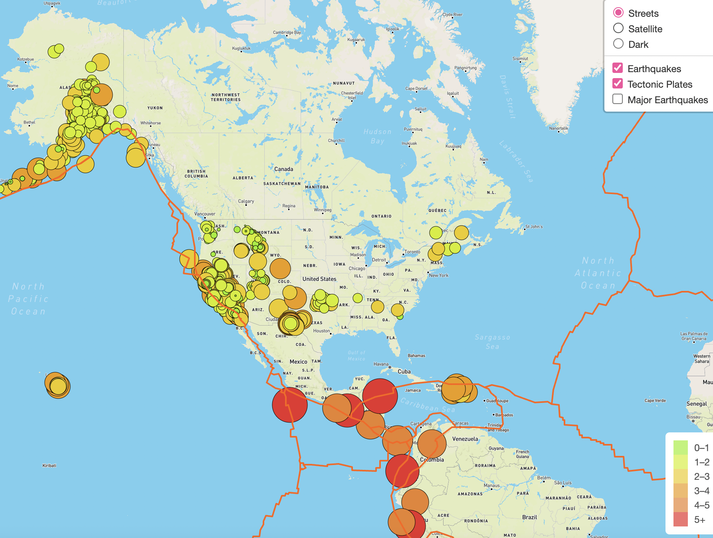
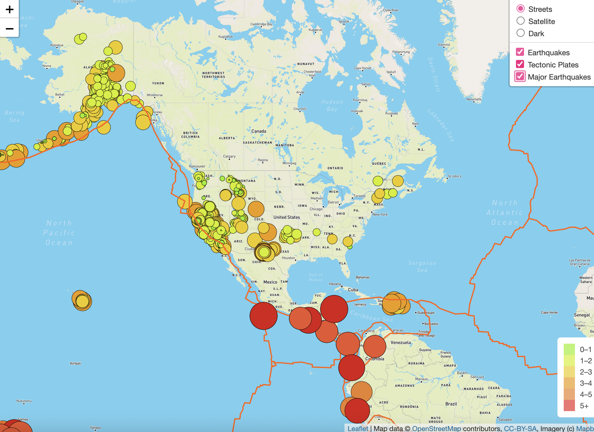
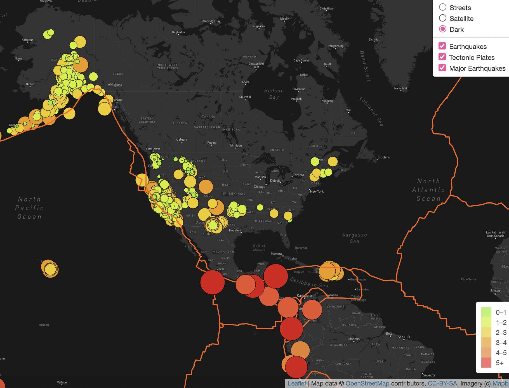

# Mapping Earthquakes with JS and APIs 

## Overview of the Analysis 
Basil is the head of the earthquake disaster response team for the Disaster Reporting Network, a nonprofit company that provides data driven storytelling on disasters around the world. 

He wanted to build insightful data visualizations with interactive features on earthquakes from around the world as he believes that this project will be useful for his team which includes reporters and data visualization specialists. 

Heh hasked for help to support website and mobile application development by using the latest earthquake GeoJSON data from the US Geological Survey website, then traverse and retrieve the earthquake data using JavaScript and the D3 and leaflet libraries and plot the data on a Mapbox map through an API request. 

On the map, the magnitude and location of each earthquake is shown in a popup marker. The Diameter of the markers for each earthquake reflect the magnitude of the earthquake in their size and colour. 

Basil and Sadhana like how the earthquake map was created with two different maps and the earthquake overlay. Now, Basil and Sadhana would like to see the earthquake data in relation to the tectonic plates’ location on the earth, and they would like to see all the earthquakes with a magnitude greater than 4.5 on the map, and they would like to see the data on a third map.

## Analysis Process 

## Added Tectonic Plate Data
Used JavaScript, Leaflet.js, and geoJSON data, to add tectonic plate data using d3.json(), add the data using the geoJSON() layer, set the tectonic plate LineString data to stand out on the map, and add the tectonic plate data to the overlay object with the earthquake data.

Below is what the map looks like with the Tectonic Plates layer added. 

For more information on how this was done, please see the following files:
* [challenge_logic](Earthquake_Challenge/static/js/challenge_logic.js)
* [index](Earthquake_Challenge/index.html)

## Added Major Earthquake Data
Used JavaScript, Leaflet.js, and geoJSON data, to add major earthquake data to the map using d3.json(). Also added color and set the radius of the circle markers based on the magnitude of earthquake, and added a popup marker for each earthquake that displays the magnitude and location of the earthquake using the GeoJSON layer, geoJSON().

The following 3 colors were used for the 3 major earthquake magnitude ranges in the Major Earthquake Magntitude data:
* #800d0d for magnitudes greater than 6
* #d91616 for magnitudes greater than 5
* #ea532c for magnitudes less than five 

Below is what the map looks like with the Major Earthquakes layer added, in addition to the Tectonic Plates Layer. 

For more information on how this was done, please see the following files:
* [challenge_logic](Earthquake_Challenge/static/js/challenge_logic.js)
* [index](Earthquake_Challenge/index.html)

## Added an Additional Map

Used JavaScript and Leaflet.js to add a third map style to your earthquake map. 

Added the dark mode map style option to the map. 

Below is what the dark map style option looks like with the Major Earthquakes and Tectonic Plates Layers. 

For more information on how this was done, please see the following files:
* [challenge_logic](Earthquake_Challenge/static/js/challenge_logic.js)
* [index](Earthquake_Challenge/index.html)
